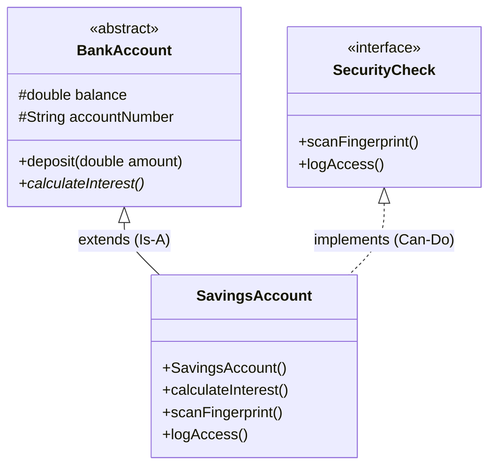

# Interface vs. Abstract Class in Java

## 1. The High-Level Concept

The difference between an Interface and an Abstract Class is often summarized as **"Can-Do" vs. "Is-A"**.

### **Interface (The Contract)**
* **Concept:** Represents a **capability** or a contract. It tells you *what* an object can do, but not *how*.
* **Analogy:** A "USB Port". It doesn't care if you plug in a mouse, a keyboard, or a fan. As long as the device fits the shape (follows the contract), it works.
* **Relationship:** "A Dog `implements` Runnable." (A Dog *can* run, but a Dog *is not* a Run).

### **Abstract Class (The Template)**
* **Concept:** Represents a **base identity** with some common pre-written logic. It is used when multiple classes share the same structure (fields) and behavior.
* **Analogy:** A "Vehicle". A Car and a Truck are both Vehicles. They both have engines and tires (shared code), but they drive differently (abstract logic).
* **Relationship:** "A Dog `extends` Animal." (A Dog *is an* Animal).

---

## 2. Comparison Table

| Feature | Interface | Abstract Class |
| :--- | :--- | :--- |
| **State (Variables)** | Cannot hold state. Variables are implicitly `static final` (constants). | **Can hold state.** Can have normal instance variables (e.g., `balance`, `name`). |
| **Constructors** | No constructors allowed. | **Can have constructors** to initialize variables. |
| **Methods** | Abstract methods (mostly). Java 8+ allows `default` and `static` methods. | Can have both Abstract methods (no body) and Concrete methods (full logic). |
| **Inheritance** | A class can implement **Multiple** interfaces. | A class can extend only **One** abstract class. |
| **Access Modifiers** | Methods are `public` by default. | Methods can be `public`, `protected`, `private`, etc. |
| **Best Use Case** | Decoupling systems. Defining capabilities (e.g., `Serializable`, `Cloneable`). | Code reuse. Sharing common logic across closely related classes. |

---

## 3. Real-World Code Example: Banking System

In this example:
1.  **`SecurityCheck` (Interface):** Represents the ability to verify identity. A Bank Account can verify identity, but so can a Phone or a Door Lock. It's a capability.
2.  **`BankAccount` (Abstract Class):** Represents the core data of an account. All accounts have a `balance` and an `accountNumber`. We don't want to rewrite this for every account type.

### A. The Interface (Capability)

```java
package com.bank.security;

// Any object that implements this promises it can scan a fingerprint.
// It doesn't matter if it's a Bank Account or a Safe.
public interface SecurityCheck {
    boolean scanFingerprint();
    void logAccess(String timestamp);
}
```

### B. The Abstract Class (Common Logic & State)

```java
package com.bank.account;

// We use an Abstract Class because Savings and Checking accounts
// SHARE the state 'balance' and the logic 'deposit'.
public abstract class BankAccount {
    protected double balance; // State! Interface cannot do this.
    protected String accountNumber;

    // Constructor! Interface cannot do this.
    public BankAccount(String accountNumber, double initialBalance) {
        this.accountNumber = accountNumber;
        this.balance = initialBalance;
    }

    // Concrete Method (Shared Logic)
    public void deposit(double amount) {
        this.balance += amount;
        System.out.println("Deposited: $" + amount + ". New Balance: $" + balance);
    }

    // Abstract Method (Logic changes per child)
    // Savings calculates interest differently than Checking.
    public abstract void calculateInterest(); 
}
```

### C. The Concrete Class (Combining Both)

```java
package com.bank.account;

import com.bank.security.SecurityCheck;

// "SavingsAccount IS-A BankAccount" (extends)
// "SavingsAccount CAN-DO SecurityCheck" (implements)
public class SavingsAccount extends BankAccount implements SecurityCheck {

    public SavingsAccount(String accNum, double bal) {
        super(accNum, bal); // Calls the Abstract Class constructor
    }

    // Implementation of Abstract Class method
    @Override
    public void calculateInterest() {
        double interest = this.balance * 0.05;
        System.out.println("Interest added: $" + interest);
    }

    // Implementation of Interface method
    @Override
    public boolean scanFingerprint() {
        System.out.println("Scanning fingerprint for Savings Account...");
        return true;
    }

    @Override
    public void logAccess(String timestamp) {
        System.out.println("Account accessed at " + timestamp);
    }
}
```

---

## 4. Visual Diagram

This UML diagram shows the relationships. Note the **dashed line** for Interfaces (Realization) and the **solid line** for Abstract Classes (Generalization).



---

## 5. Senior Level Interview Q&A

### Q1: Since Java 8 introduced `default` methods in interfaces, aren't Abstract Classes obsolete?
**Answer:**
"No, they are not. While `default` methods allow interfaces to have code implementation, Interfaces still **cannot hold state** (instance variables).
If I need a base class to manage a variable like `protected double balance`, I must use an Abstract Class. Interfaces are stateless; Abstract classes are stateful."

### Q2: Can a class extend an Abstract Class and an Interface at the same time?
**Answer:**
"Technically, you extend a class and implement an interface. Yes, a class can `extend` exactly **one** Abstract Class (single inheritance) but `implement` **multiple** Interfaces. This allows us to define a strict hierarchy (SavingsAccount is a BankAccount) while mixing in various capabilities (it is also `Serializable`, `Cloneable`, and `SecurityCheck`)."

### Q3: When should I choose an Interface over an Abstract Class?
**Answer:**
"I use the **'Role vs. Identity'** rule:
1.  If I am defining a **Role** or capability that can apply to unrelated objects (e.g., `Flyable` applies to a Bird and an Airplane), I use an **Interface**.
2.  If I am building a family of closely related objects that share attributes and code (e.g., `Bird` is the parent of `Eagle` and `Penguin`), I use an **Abstract Class**."